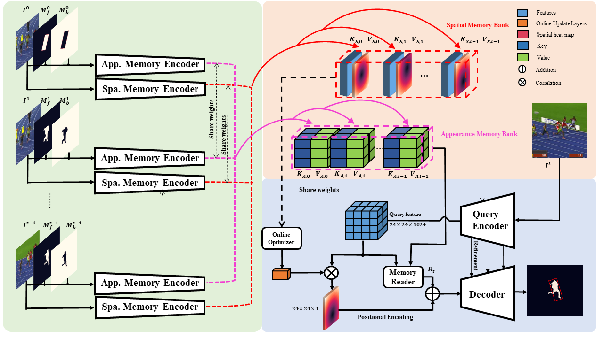

# Discriminative Segmentation Tracking Using Dual Memory Banks

Python (PyTorch) implementation of the DMB tracker.

## Publication:
Fei Xie, Wankou Yang, Bo Liu, Kaihua Zhang, Wanli Xue, Wangmeng Zuo.


<b>Discriminative Segmentation Tracking Using Dual Memory Banks

[Paper](https://arxiv.org/pdf/2009.09669.pdf) </br>

The original paper will be reproduced as 

Learning Spatio-Appearance Memory Network for High-Performance Visual Tracking

Full version of code will be available after this method is publicily published. 

## Summary of the DMB tracker 
Existing  template-based  trackers  usually  localize  the  target in each frame with  bounding  box,  thereby  being  limited in learning pixel-wise representation and handling complex and  non-rigid  transformation  of  the  target.  Further,  existing  segmentation  tracking  methods  are  still  insufficient  in modeling and exploiting dense correspondence of target pixels across frames. To overcome these limitations, this work presents a novel discriminative segmentation tracking architecture equipped with dual memory banks, i.e., appearance memory  bank  and  spatial  memory  bank.  In  particular,  the appearance memory bank utilizes spatial and temporal non-local similarity to propagate segmentation mask to the current frame,  and  we  further  treat  discriminative  correlation  filter as spatial memory bank to store the mapping between feature  map  and  spatial  map.  In particular, we store keys and values of continuous frames in the AMB, and design a memory reader to compute the spatio-temporal attention to previous frames for each pixel in the query image (i.e., the current frame).Thus,  albeit  the  network  parameters  of  the  memory  module are fixed, we can dynamically update the memory bank to achieve better trade-off between model generalization and flexibility. We further treat DCF as spatial memory bank (SMB) to model the mapping between feature map and spatial map. Moreover, the SMB helps to filter out the dirty samples in AMB while AMB provides SMB with more accurate  target  geometrical  center.  This  mutual  promotion on  dual  memory  banks  greatly  boost  the  tracking  performance. We also adopt box-to-segmentation training and testing strategy to mitigate inaccurate representation of bounding box initialization during tracking.



## Installation

#### Clone the GIT repository.  
```bash
git clone https://github.com/phiphiphi31/DMB .
```

#### Install dependencies
Run the installation script to install all the dependencies. You need to provide the conda install path (e.g. ~/anaconda3) and the name for the created conda environment (here ```pytracking```).  
```bash
bash install.sh conda_install_path pytracking
```

The tracker was tested on the Ubuntu 16.04 machine with 4 NVidia GTX Titan XP graphics card and cudatoolkit version 9.

#### Test the tracker
1.) Specify the path to the DMB by setting the `params.pth_path` in the `pytracking/parameters/DMB/DMB_default_params.py`. <br/>
2.) Specify the path to the VOT 2018 dataset by setting the `self.data_root` in the `votTester/vot.py`. <br/>
3.) Activate the conda environment
```bash
conda activate pytracking
```
4.) Run the run_vot_test.py to run DMB using VOT18 sequences.  
```bash
python run_vot_test.py
```

#### Training the network
The DMB is pre-trained for segmentation task only on the YouTube VOS dataset. Thanks to the training dataset provided from D3S.

######  <b>D3S - A Discriminative Single Shot Segmentation Tracker.</b>

Please refer to https://github.com/alanlukezic/d3s.git for details to prepare training dataset.
Please modify the dataset path in `libs/dataset/data.py` and `libs/train_data/vos.py`
. Stage-1 pretrained model and training setting file will be available soon. 
```bash
python train_stage2.py
```

## Pytracking
We use a part of the python framework pytracking based on **PyTorch**. We would like to thank the authors Martin Danelljan and Goutam Bhat for  such a amazing framework. We also thanks to the author Alan Lukežič for his great work D3S!

## Contact
* Fei Xie (email: jaffe03@seu.edu.cn)
* Wankou Yang (email: wkyang@seu.edu.cn)

